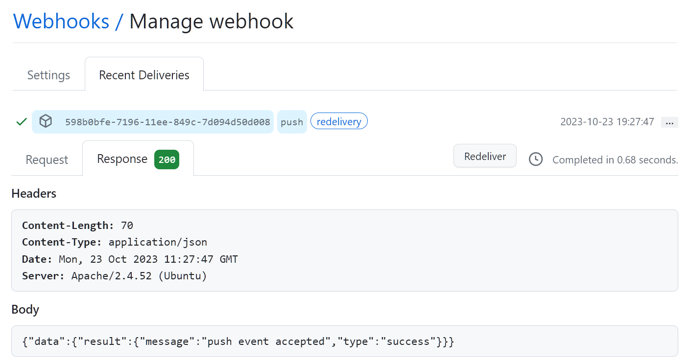
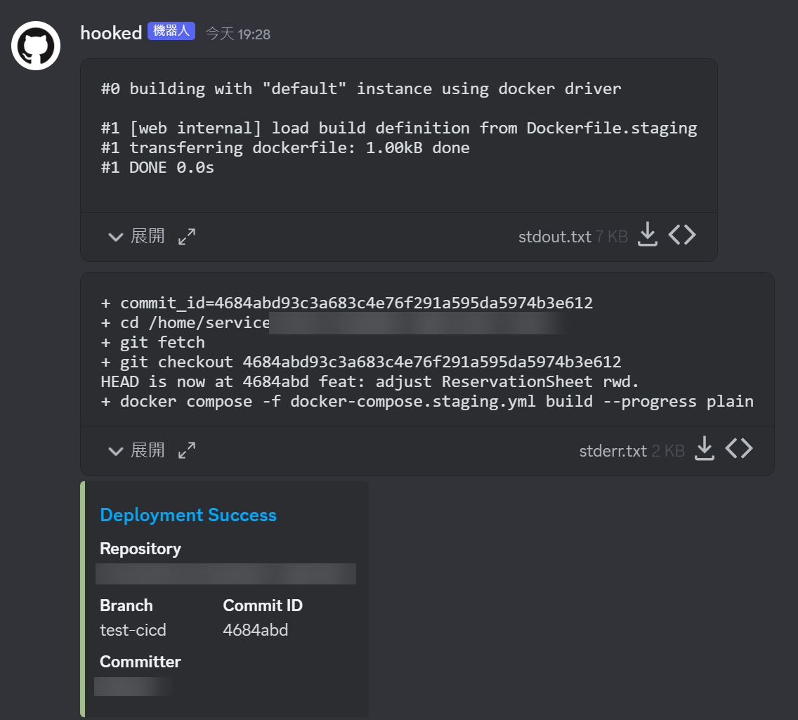

# hooked

A simple command-line CI/CD tool that triggers custom build and deployment commands when it receives the GitHub webhook messages. It also supports Discord notification (including the stdout and stderr outputs).

## Screenshots




## Installation

### Build from the source code

Clone the repository:

```txt
git clone https://github.com/jlhg/hooked.git
```

Run `cargo build`:

```txt
cd hooked
cargo build --release
```

You can find the executable file at `./target/release/hooked`.

## Usage

Find the usage:

```txt
hooked --help
```

The available arguments are described below:

- `-l, --log`: The domain or IP address where the server is hosted.
- `-h, --host`: The domain or IP address where the server is hosted.
- `-p, --port`: The port number where the server is listening.
- `--build-entry-script-path`: Path to the build entry script.
- `--github-webhook-secret`: The token to verify the incoming GitHub webhook messages. See [Creating webhooks - GitHub Docs](https://docs.github.com/en/webhooks/using-webhooks/creating-webhooks) for creating a webhook and setting the secret token.
- `--github-watch-push-branch`: The Git branch name to watch.
- `--discord-webhook-url`: The Discord webhook URL to send the notification to Discord channel. See [Intro to Webhooks – Discord](https://support.discord.com/hc/en-us/articles/228383668-Intro-to-Webhooks) for creating a Discord webhook URL.

Configure the Github Webhook. Set the payload URL to `<your-server-address>/webhooks/github`.

Copy the example `build.sh` to the current directory. Open it and add whatever commands you want to execute.

```txt
cp example/build.sh .
```

Finally, start the web server:

```txt
hooked -h 0.0.0.0 -p 3000 --build-entry-script-path=./build.sh \
  --github-webhook-secret=<string> --github-watch-push-branch=master \
  --discord-webhook-url=<string>
```

## License

Released under the [MIT License](https://opensource.org/license/mit/).
